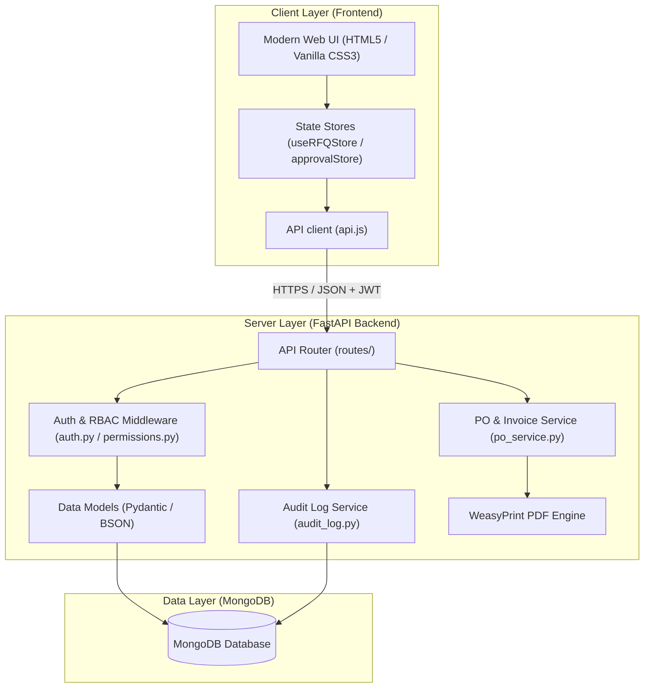
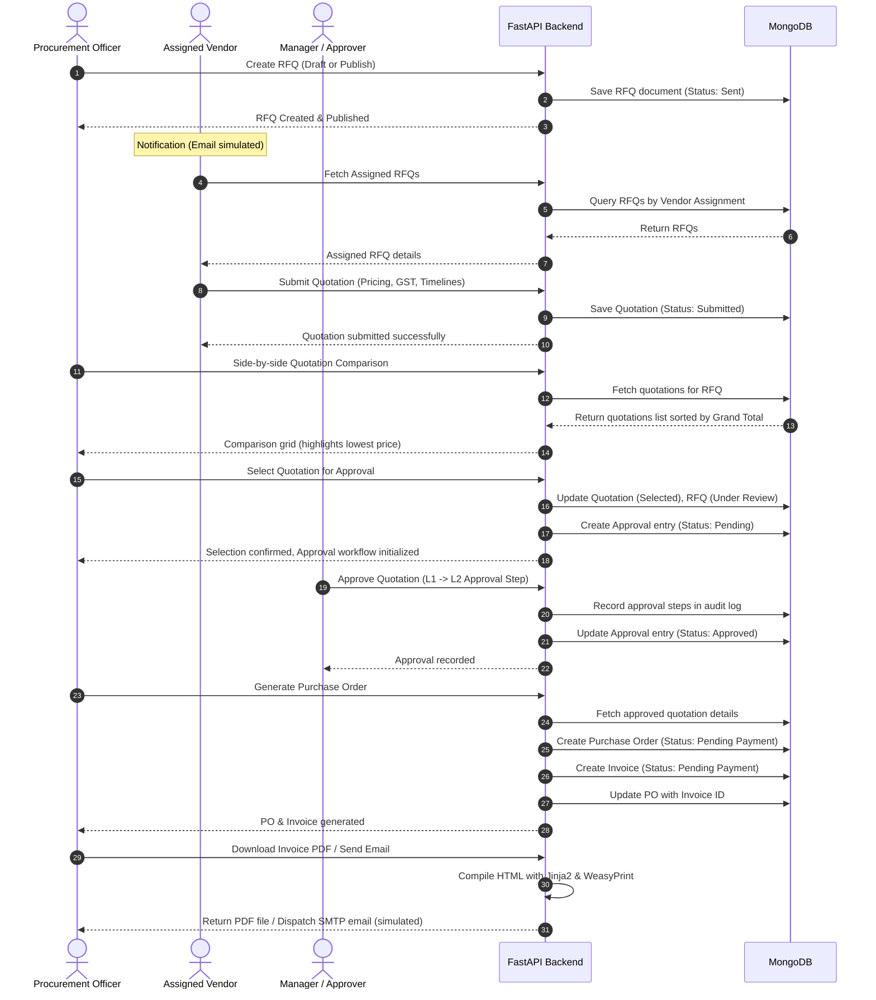
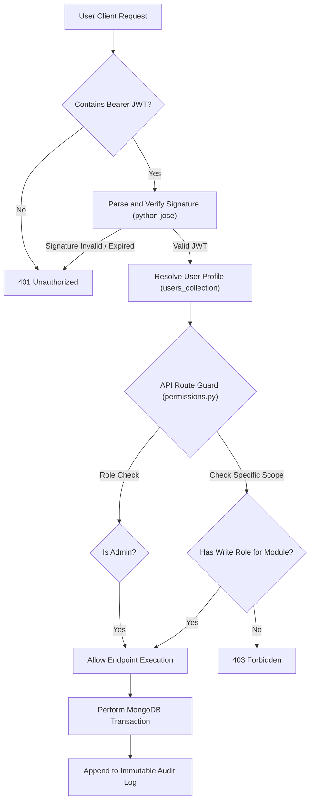
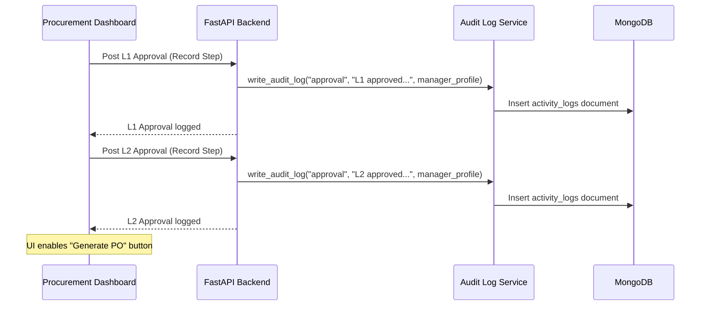

# Architecture Diagram

This document contains the system architecture diagram for VendorBridge.

To display the diagram in this repository you can add the image file at:

- `docs/architecture.png` (recommended)

Once the image is present, this file will render it inline. Example markdown:


Notes and guidance:

- The diagram shows the frontend (static HTML/CSS/JS) communicating with the FastAPI backend over HTTPS using JWT bearer tokens.
- MongoDB is the primary data store for users, vendors, RFQs, quotations, approvals, purchase orders, invoices, and activity logs.
- External services include an SMTP server for email dispatch and WeasyPrint for PDF generation.

If you'd like, I can add the actual image file (`docs/architecture.png`) into the repository — please either upload it here or tell me to pull it from a URL.
# VendorBridge System Architecture

VendorBridge is an enterprise-grade, lightweight Procurement & Vendor Management ERP system. It bridges the gap between buyers and vendors by replacing spreadsheet-based workflows with a centralized, role-based RFQ-to-Invoice ERP portal.

This document outlines the architectural patterns, database schemas, workflows, and implementation strategies that govern the VendorBridge platform.

---

## 🗺️ 1. High-Level Architecture Topology

VendorBridge is built on a modern **Client-Server Architecture** utilizing a stateless RESTful backend API and a modular, responsive frontend client.



---

## 🗄️ 2. Database Schema Design (MongoDB)

VendorBridge uses **MongoDB** as its primary datastore. Interactivity is managed asynchronously using the **Motor** client. Below are the key collections, schemas, and relationships.

### `users`
Represents the accounts registered on the system.
*   `_id`: `ObjectId` (Primary Key)
*   `full_name`: `String` (2–100 characters)
*   `email`: `String` (Indexed, unique format)
*   `password_hash`: `String` (Bcrypt hashed)
*   `role`: `String` (Enum: `"Admin"`, `"Procurement Officer"`, `"Vendor"`, `"Manager"`)
*   `company`: `String` (Optional; required for Vendors)
*   `gstin`: `String` (Optional; required for Vendors)
*   `phone`: `String` (Optional)
*   `is_active`: `Boolean`
*   `created_at`: `DateTime`
*   `updated_at`: `DateTime`

### `vendors`
Holds vendor records and profile tracking details.
*   `_id`: `ObjectId`
*   `name`: `String`
*   `category`: `String` (Enum: `"Construction"`, `"IT"`, `"Logistics"`, `"Manufacturing"`, `"Services"`, `"Other"`)
*   `gst_number`: `String` (15-character GSTIN format)
*   `contact_person`: `String`
*   `email`: `String` (Used to link to User accounts)
*   `phone`: `String`
*   `status`: `String` (Enum: `"Active"`, `"Pending"`, `"Blocked"`)
*   `kyc_status`: `String` (Enum: `"Verified"`, `"Pending"`, `"Expired"`)
*   `rating`: `Float` (1.0 to 5.0)
*   `created_at`: `DateTime`
*   `updated_at`: `DateTime`

### `rfqs`
Contains request-for-quotation records generated by procurement staff.
*   `_id`: `ObjectId`
*   `title`: `String`
*   `category`: `String` (References `categories` collection slug)
*   `deadline`: `DateTime` (Must be in the future)
*   `description`: `String`
*   `line_items`: `Array` of Objects:
    *   `id`: `String` (UUID)
    *   `item_name`: `String`
    *   `qty`: `Float`
    *   `unit`: `String` (References `units` collection code)
*   `assigned_vendor_ids`: `Array` of Strings (`vendor_id` references)
*   `assigned_vendors`: `Array` of Objects (Snapshots containing `id`, `name`, `email` for fast lookups)
*   `attachments`: `Array` of Objects:
    *   `id`: `String` (UUID)
    *   `filename`: `String`
    *   `original_name`: `String`
    *   `size`: `Integer`
    *   `mime_type`: `String`
    *   `path`: `String`
*   `status`: `String` (Enum: `"Draft"`, `"Sent"`, `"Received"`, `"Closed"`, `"Under Review"`)
*   `selected_quotation_id`: `String` (Optional, links to Selected Quotation)
*   `created_by`: `String` (`user_id` reference)
*   `created_at`: `DateTime`
*   `updated_at`: `DateTime`

### `quotations`
Quotes submitted by Vendors in response to assigned RFQs.
*   `_id`: `ObjectId`
*   `rfq_id`: `String` (References `rfqs._id`)
*   `rfq_title`: `String`
*   `vendor_id`: `String` (References `vendors._id`)
*   `vendor_name`: `String`
*   `line_items`: `Array` of Objects:
    *   `item_name`: `String`
    *   `qty`: `Float`
    *   `unit`: `String`
    *   `unit_price`: `Float`
    *   `total`: `Float` (Calculated as `qty * unit_price`)
    *   `delivery_days`: `Integer`
*   `tax_percent`: `Float` (GST percentage)
*   `subtotal`: `Float`
*   `tax_amount`: `Float`
*   `grand_total`: `Float` (Calculated as `subtotal + tax_amount`)
*   `notes`: `String`
*   `payment_terms_days`: `Integer` (Optional)
*   `status`: `String` (Enum: `"Draft"`, `"Submitted"`, `"Selected"`, `"Not Selected"`)
*   `created_at`: `DateTime`
*   `updated_at`: `DateTime`

### `approvals`
Tracks the review cycles of selected quotations.
*   `_id`: `ObjectId`
*   `title`: `String`
*   `type`: `String` (e.g., `"Quotation"`)
*   `amount`: `Float` (Grand Total from Quotation)
*   `status`: `String` (Enum: `"Pending"`, `"Approved"`, `"Rejected"`)
*   `priority`: `String` (Enum: `"High"`, `"Medium"`, `"Low"`)
*   `rfq_id`: `String`
*   `quotation_id`: `String`
*   `vendor_id`: `String`
*   `vendor_name`: `String`
*   `requested_by`: `String` (`user_id`)
*   `created_at`: `DateTime`

### `purchase_orders`
Official PO contracts generated post-approval.
*   `_id`: `ObjectId`
*   `po_number`: `String` (Unique sequential identifier: e.g., `PO-2026-0001`)
*   `quotation_id`: `String`
*   `rfq_id`: `String`
*   `rfq_title`: `String`
*   `approval_id`: `String`
*   `vendor_id`: `String`
*   `vendor_name`: `String`
*   `vendor`: `Object` (Vendor contact snapshot: address, gstin, email, phone)
*   `bill_to`: `Object` (Purchaser billing snapshot)
*   `line_items`: `Array` of normalized objects
*   `subtotal`: `Float`
*   `cgst`: `Float` (Central GST: 9%)
*   `sgst`: `Float` (State GST: 9%)
*   `grand_total`: `Float` (Subtotal + CGST + SGST)
*   `status`: `String` (Enum: `"Pending Payment"`, `"Paid"`, `"Cancelled"`, `"Delivered"`)
*   `po_date`: `DateTime`
*   `invoice_date`: `DateTime`
*   `due_date`: `DateTime`
*   `invoice_id`: `String` (Reference to corresponding invoice)
*   `created_by`: `String`
*   `created_at`: `DateTime`
*   `updated_at`: `DateTime`

### `invoices`
Invoices generated automatically alongside Purchase Orders.
*   `_id`: `ObjectId`
*   `invoice_number`: `String` (Unique sequential identifier: e.g., `INV-2026-0001`)
*   `po_id`: `String`
*   `po_number`: `String`
*   `quotation_id`: `String`
*   `rfq_id`: `String`
*   `rfq_title`: `String`
*   `bill_to`: `Object`
*   `vendor`: `Object`
*   `line_items`: `Array`
*   `subtotal`: `Float`
*   `cgst`: `Float`
*   `sgst`: `Float`
*   `grand_total`: `Float`
*   `status`: `String` (Synchronized with PO status)
*   `po_date`: `DateTime`
*   `invoice_date`: `DateTime`
*   `due_date`: `DateTime`
*   `email_logs`: `Array` of email transaction logs
*   `created_by`: `String`
*   `created_at`: `DateTime`
*   `updated_at`: `DateTime`

### `activity_logs`
The append-only audit trail capturing key system actions.
*   `_id`: `ObjectId`
*   `type`: `String` (Enum: `"rfq"`, `"quotation"`, `"approval"`, `"invoice"`, `"vendor"`)
*   `message`: `String` (Human-readable description)
*   `performed_by`: `ObjectId` (User reference ID)
*   `performer_name`: `String`
*   `related_id`: `String` (References the affected entity ID)
*   `action`: `String` (Machine token: e.g., `"rfq_published"`, `"quotation_selected"`)
*   `created_at`: `DateTime`

---

## 🔄 3. System Interaction Workflows

### 3.1 End-to-End Procurement Lifecycle
Below is the sequence of events from RFQ creation to PDF compilation and invoice email delivery.



---

### 3.2 Authentication & Route-Guard Middleware
Requests sent to the API are intercepted by the authentication and authorization layer.



---

### 3.3 Two-Stage Approval Workflow
Selected quotations enter a structured approval flow before procurement staff can draft official documents.



---

## 🔒 4. Security Architecture

VendorBridge enforces security best practices across all components:

1.  **State-Store JWT Security**: JSON Web Tokens are used for stateless user sessions. Token expiry is set to 24 hours (`1440` minutes). Middleware checks the request headers for `Authorization: Bearer <token>` on all routes except registration/login.
2.  **Role-Based Access Control (RBAC)**: Enforced via FastAPI dependencies (`permissions.py`). Users are strictly isolated based on roles:
    *   **Vendors** are restricted from querying comparative bids, modifying others' quotes, or reading other vendors' records.
    *   **Procurement Officers** can draft RFQs and compile POs but cannot approve select bids.
    *   **Managers** can record L1/L2 approval decisions.
3.  **Cryptographic Security**: Passwords are saved as standard bcrypt-hashes. Direct plaintext string storage is prohibited.
4.  **Audit Trail Immutability**: The activity log service provides a **write-once-read-only** interface. No route permits update (`PUT`/`PATCH`) or deletion (`DELETE`) on the `activity_logs` collection, ensuring compliance and transparent transaction history.

---

## 📂 5. Directory Layout & Core Modules

The platform is structured into clear modules to ensure separation of concerns:

```text
VendorBridge/
├── backend/
│   ├── main.py                     # API Application entry point
│   ├── config.py                   # MongoDB connections & Env settings
│   ├── auth.py                     # User password hashing & JWT generation
│   ├── models.py                   # Pydantic payloads and models
│   ├── permissions.py              # Middleware dependencies for RBAC
│   ├── routes/                     # API routers organized by domain
│   │   ├── auth_routes.py          # Session and registration management
│   │   ├── vendor_routes.py        # Vendor profiles and KYC management
│   │   ├── rfq_routes.py           # RFQ lifecycle
│   │   ├── quotation_routes.py     # Quotation entry, submission, comparison
│   │   ├── approval_audit_routes.py# Transition auditing
│   │   ├── purchase_order_routes.py# PO generation
│   │   ├── invoice_routes.py       # Billing summaries, PDF compiler
│   │   ├── activity_routes.py      # Audit trail fetchers
│   │   └── reports_routes.py       # KPI analytics aggregations
│   ├── services/                   # Business logic layers
│   │   ├── audit_log.py            # Immutable logger
│   │   └── po_service.py           # PO number generation & calculations
│   └── templates/                  # Document templates
│       └── invoice_pdf.html        # HTML layout for PDF printing
│
└── frontend/                       # Client Web Application
    ├── index.html                  # Main gate login
    ├── css/                        # Modular stylesheet system
    │   ├── globals.css             # Light-themed corporate tokens
    │   └── *.css                   # Module-specific styling
    └── js/                         # Script modules
        ├── api.js                  # Client API layer (Api.request wrapper)
        ├── layout.js               # Common shell components (Navbar, Footer)
        ├── store/                  # Client-side UI State stores
        │   ├── approvalStore.js    # Approval state management
        │   └── useRFQStore.js      # RFQ state management
        └── *.js                    # Domain script controllers
```