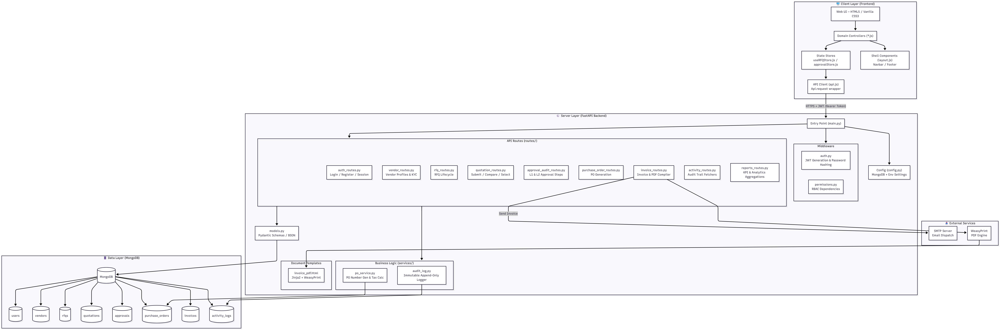

# VendorBridge

> Procurement & Vendor Management ERP for structured RFQ-to-invoice workflows.


### Architecture Diagram



_If the diagram does not display, open [ARCHITECTURE.md](./ARCHITECTURE.md) or view `docs/architecture.png` in the repo._

## 📚 Table of Contents

1. [About the Project](#-about-the-project)
2. [Features](#-features)
3. [Tech Stack](#-tech-stack)
4. [Project Structure](#-project-structure)
5. [Getting Started](#-getting-started)
6. [Environment Variables](#-environment-variables)
7. [API Documentation](#-api-documentation)
8. [User Roles & Permissions](#-user-roles--permissions)
9. [Workflow](#-workflow)
10. [Key Design Decisions](#-key-design-decisions)
11. [System Architecture](#-system-architecture)


## ✨ About the Project

### What is VendorBridge?

VendorBridge is a centralized procurement and vendor management ERP that connects vendors, RFQs, quotations, approvals, purchase orders, invoices, reporting, and audit logging in one streamlined workflow.

### Problem it solves

Procurement teams often manage vendors and buying cycles across spreadsheets, email threads, and disconnected tools. VendorBridge reduces that friction by providing a structured system for:

- Vendor onboarding and vendor status tracking
- RFQ creation and distribution
- Vendor quotation submission and comparison
- Multi-step procurement approvals
- Purchase order and invoice generation
- PDF export, email delivery, and activity tracking

### Key highlights

- Role-based procurement workflow from RFQ to invoice
- Immutable audit logs for accountability and traceability
- JWT-based authentication and secure session handling
- Dynamic PDF generation for invoices on demand
- Modular frontend and backend structure for maintainability

## 🚀 Features

### Core screens

1. **Login / Signup Screen** - Authentication entry point with email/password login, signup, forgot password, session handling, validation, and role-based access.
2. **Dashboard / Home Screen** - Snapshot of procurement activity with pending approvals, active RFQs, recent purchase orders, recent invoices, and quick action shortcuts.
3. **Vendor Management Screen** - Manage vendor records, categories, GST details, contact data, active/pending/blocked status, and search/filter controls.
4. **RFQ Creation Screen** - Create RFQs with titles, line items, quantities, attachments, deadlines, and vendor assignment.
5. **Vendor Quotation Submission Screen** - Allow vendors to submit pricing, delivery timelines, notes, and editable quotation drafts.
6. **Quotation Comparison Screen** - Compare vendor responses side by side, highlight lowest price, and review delivery, payment terms, and vendor rating data.
7. **Approval Workflow Screen** - Handle approve/reject actions, remarks, status transitions, and workflow history for procurement approvals.
8. **Purchase Order & Invoice Generation Screen** - Convert approved quotations into purchase orders and invoices with totals, tax calculations, PDF output, print-ready views, and email delivery.
9. **Activity Logs & Notifications Screen** - View audit trails, RFQ updates, approval events, and invoice activity in a centralized timeline.
10. **Reports & Analytics Screen** - Review spend summaries, vendor performance, procurement statistics, monthly trends, and CSV exports.

### Role-based access

- **Admin** - Full operational visibility, vendor administration, approvals, reports, purchase orders, invoices, and activity logs.
- **Procurement Officer** - Create RFQs, compare quotations, manage vendors, generate purchase orders, generate invoices, and review analytics.
- **Manager** - Approve or reject procurement requests, monitor workflows, view reports, and inspect audit logs.
- **Vendor** - Review assigned RFQs, submit quotations, and track procurement outcomes relevant to their profile.

## 🧰 Tech Stack

### Frontend dependencies

- HTML5, CSS3, JavaScript
- `serve` for local static hosting
- Google Fonts for typography

### Backend dependencies

- FastAPI
- Uvicorn
- Motor / PyMongo
- python-jose
- bcrypt
- python-multipart
- Pydantic
- python-dotenv
- httpx
- WeasyPrint
- Jinja2

### Database

- MongoDB

## 🗂️ Project Structure

### Frontend folder structure

```text
frontend/
├── index.html
├── dashboard.html
├── vendors.html
├── rfqs.html
├── rfq-create.html
├── quotations.html
├── quotation-comparison.html
├── approval-workflow.html
├── approvals.html
├── purchase-orders.html
├── invoices.html
├── reports.html
├── activity.html
├── reset-password.html
├── assets/
├── css/
│   ├── globals.css
│   ├── auth.css
│   ├── dashboard.css
│   ├── vendors.css
│   ├── rfq.css
│   ├── quotations.css
│   ├── quotation-comparison.css
│   ├── approval-workflow.css
│   ├── approvals.css
│   ├── purchase-orders.css
│   ├── reports.css
│   └── activity.css
└── js/
    ├── api.js
    ├── auth.js
    ├── dashboard.js
    ├── vendors.js
    ├── rfq-create.js
    ├── rfqs.js
    ├── quotations.js
    ├── quotation-comparison.js
    ├── approval-workflow.js
    ├── approvals.js
    ├── purchase-orders.js
    ├── reports.js
    ├── activity.js
    ├── layout.js
    ├── components.js
    ├── useVendors.js
    ├── vendorValidation.js
    ├── services/
    ├── store/
    ├── types/
    └── config/
```

### Backend folder structure

```text
backend/
├── main.py
├── config.py
├── auth.py
├── models.py
├── permissions.py
├── seed.py
├── rfq_config_data.py
├── requirements.txt
├── routes/
│   ├── auth_routes.py
│   ├── dashboard_routes.py
│   ├── vendor_routes.py
│   ├── rfq_routes.py
│   ├── quotation_routes.py
│   ├── approval_audit_routes.py
│   ├── purchase_order_routes.py
│   ├── invoice_routes.py
│   ├── activity_routes.py
│   └── reports_routes.py
├── services/
│   ├── audit_log.py
│   ├── po_service.py
│   └── reports_service.py
├── templates/
│   └── invoice_pdf.html
├── uploads/
│   └── rfq/
└── utils/
    ├── errors.py
    ├── sanitize.py
    └── vendor_validation.py
```

## 🏁 Getting Started

### Prerequisites

- Python 3.11+ recommended
- Node.js 18+ recommended
- MongoDB running locally or accessible through MongoDB Atlas

### Frontend installation

1. Open a terminal in the `frontend` folder.
2. Install dependencies:

```bash
npm install
```

3. Start the static frontend server:

```bash
npm run dev
```

4. Open the app at `http://localhost:3000`.

### Backend installation

1. Open a terminal in the `backend` folder.
2. Create and activate a virtual environment.
3. Install backend dependencies:

```bash
pip install -r requirements.txt
```

4. Start the API server:

```bash
uvicorn main:app --reload --host 0.0.0.0 --port 8000
```

5. Open the API docs at `http://localhost:8000/api/docs`.

### MongoDB setup

1. Start a local MongoDB instance or create a MongoDB Atlas cluster.
2. Create a database for VendorBridge, for example `vendorbridge_db`.
3. Update the backend environment variables to point to your MongoDB connection string.
4. On startup, the backend seeds vendor and RFQ reference data and creates the required indexes.

### Environment variables example

```bash
# backend/.env
MONGODB_URL=mongodb://localhost:27017
DATABASE_NAME=vendorbridge_db
SECRET_KEY=replace-with-a-long-random-secret
ALGORITHM=HS256
ACCESS_TOKEN_EXPIRE_MINUTES=1440
```

## 🔐 Environment Variables

### Frontend `.env`

The current frontend code uses a fixed API base URL in `frontend/js/api.js`, so no frontend environment variables are required for the existing implementation.

Optional example if you want to externalize the API URL:

```bash
VITE_API_BASE_URL=http://localhost:8000/api
```

### Backend `.env`

Required keys:

```bash
MONGODB_URL=mongodb://localhost:27017
DATABASE_NAME=vendorbridge_db
SECRET_KEY=replace-with-a-long-random-secret
ALGORITHM=HS256
ACCESS_TOKEN_EXPIRE_MINUTES=1440
```

## 📘 API Documentation

All endpoints are mounted under `/api`.

### Auth

- `POST /api/auth/signup` - Create a user account
- `POST /api/auth/login` - Authenticate and receive a JWT
- `POST /api/auth/forgot-password` - Start password reset flow
- `POST /api/auth/reset-password` - Complete password reset
- `GET /api/auth/me` - Fetch the current user profile
- `POST /api/auth/logout` - End the current session

### Vendors

- `GET /api/vendors` - List vendors with search, pagination, and status filters
- `GET /api/vendors/{vendor_id}` - Get a single vendor
- `POST /api/vendors` - Create a vendor
- `PUT /api/vendors/{vendor_id}` - Update a vendor
- `PATCH /api/vendors/{vendor_id}/status` - Update vendor status

### RFQs

- `GET /api/rfqs/config` - Fetch RFQ configuration and validation rules
- `GET /api/categories` - List RFQ categories
- `GET /api/units` - List unit master data
- `GET /api/rfqs` - List the current user’s RFQs
- `GET /api/rfqs/{rfq_id}` - Get RFQ details
- `POST /api/rfqs/draft` - Save an RFQ as draft
- `POST /api/rfqs/send` - Publish an RFQ to vendors

### Quotations

- `GET /api/quotations/rfqs` - List RFQs available to the logged-in vendor
- `GET /api/quotations/rfq/{rfq_id}` - Fetch RFQ details for vendor quotation entry
- `GET /api/quotations` - List quotations
- `POST /api/quotations/draft` - Save a quotation draft
- `POST /api/quotations/submit` - Submit a vendor quotation
- `GET /api/quotations/compare/rfqs` - List RFQs ready for comparison
- `GET /api/quotations/compare/{rfq_id}` - Compare quotations side by side
- `POST /api/quotations/select` - Select a quotation and start approval workflow

### Approvals

- `POST /api/approvals/audit-step` - Record an L1 or L2 approval event in the audit log

### Purchase Orders

- `POST /api/purchase-orders` - Generate a purchase order from a selected quotation
- `GET /api/purchase-orders` - List purchase orders for the current user
- `GET /api/purchase-orders/{po_id}` - Fetch purchase order details
- `PATCH /api/purchase-orders/{po_id}/status` - Update purchase order / invoice status

### Invoices

- `GET /api/invoices/{invoice_id}` - Fetch invoice details
- `GET /api/invoices/{invoice_id}/pdf` - Generate or download the invoice PDF
- `POST /api/invoices/{invoice_id}/send-email` - Send invoice details by email

### Reports

- `GET /api/reports/stats` - Procurement summary statistics
- `GET /api/reports/spend-by-category` - Spend by category
- `GET /api/reports/top-vendors` - Top vendors by spend
- `GET /api/reports/monthly-trend` - Monthly spend trend
- `GET /api/reports/export` - Export report data as CSV

### Activity Logs

- `GET /api/activity-logs` - Read the immutable audit trail with type filters

### Dashboard

- `GET /api/dashboard/stats` - Dashboard cards and KPIs
- `GET /api/dashboard/rfqs` - Recent RFQs
- `GET /api/dashboard/purchase-orders` - Recent purchase orders
- `GET /api/dashboard/invoices` - Recent invoices
- `GET /api/dashboard/approvals` - Recent approval items

## 👥 User Roles & Permissions

| Role | What they can do |
| --- | --- |
| Admin | Manage users and vendors, view all procurement data, approve workflows, generate POs and invoices, access reports, and read audit logs. |
| Procurement Officer | Create and manage RFQs, compare quotations, manage vendors, generate purchase orders, generate invoices, and review analytics. |
| Manager | Approve or reject procurement actions, monitor workflow progress, view reports, and inspect activity logs. |
| Vendor | View assigned RFQs, submit quotations, review procurement outcomes relevant to their profile, and track progress. |

## 🔄 Workflow

1. The Procurement Officer creates an RFQ.
2. Assigned vendors receive the RFQ and submit quotations.
3. The procurement team compares quotations side by side.
4. The selected quotation enters the approval workflow.
5. Once approved, the system generates a Purchase Order.
6. The Purchase Order creates the associated Invoice.
7. The invoice can be printed as PDF or emailed directly.
8. Every major action is written to the audit log for traceability.

## 🎯 Key Design Decisions

- **Immutable audit logs** - Procurement actions are captured as append-only history for accountability and traceability.
- **JWT authentication** - The backend issues bearer tokens to secure API access and support session-based frontend flows.
- **PDF generation on demand** - Invoice PDFs are produced only when requested, keeping the workflow lightweight until export time.
- **Role-based routing** - UI navigation and API permissions are aligned so users only see and execute the actions allowed by their role.

## 🏗️ System Architecture

VendorBridge utilizes a decoupled client-server architecture. For detailed documentation on database design, flow diagrams, authentication sequence, and modular system breakdown, please check the [Architecture Documentation (ARCHITECTURE.md)](./ARCHITECTURE.md).

### High-Level Components
- **Frontend**: Lightweight, modular Vanilla HTML5/CSS3/JS utilizing CSS variables for cohesive theme management and central state stores.
- **Backend**: Asynchronous REST API built with FastAPI (Python), utilizing custom security middleware.
- **Database**: MongoDB (via Motor client) storing user accounts, vendor profiles, audit logs, and transactional items.